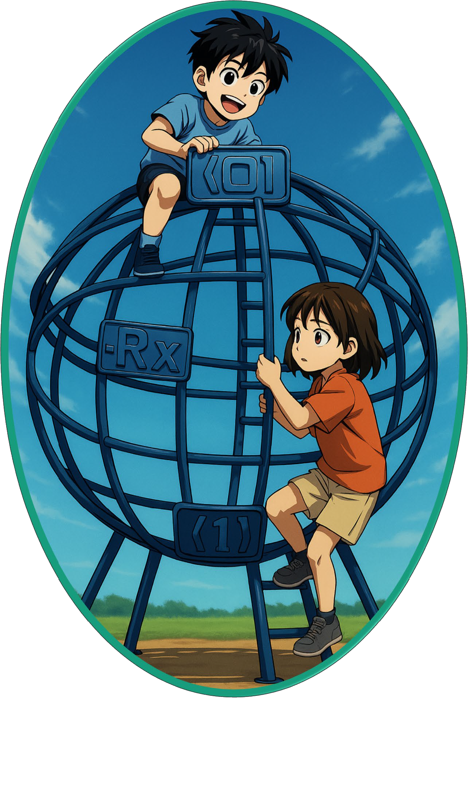
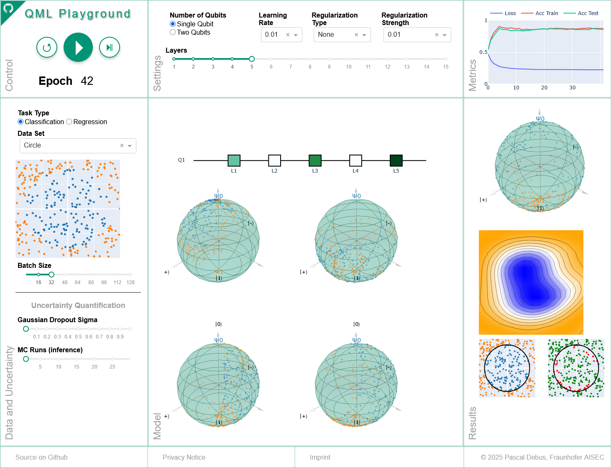

<p align="center">
  
</p>

# Quantum Machine Learning Playground

The **Quantum Machine Learning (QML) Playground** is an interactive web application designed to visualize the inner workings of quantum machine learning models in an intuitive and educational manner. Inspired by classical tools like TensorFlow Playground, it focuses on parameterized quantum circuits (PQCs) and particularly the *data re-uploading universal quantum classifier*, offering visual metaphors like Bloch spheres and the novel Q-simplex for interpreting quantum state evolution.

This playground is ideal for learners, educators, and researchers who want to explore QML models without deep expertise in quantum computing hardware or simulation backends.

---

## 🌐 Live Demo
<p align="center">
  
</p>
Explore the QML Playground directly in your browser:

👉 **[Try the Live Demo](https://websites.fraunhofer.de/qml-playground/)**

No installation required. Perfect for quick experimentation, education, and outreach.

---

## 🧠 How the Quantum Classifier Works

The playground demonstrates the **data re-uploading quantum classifier**, a variational quantum algorithm introduced by Pérez-Salinas et al. ([Quantum, 2020](https://quantum-journal.org/papers/q-2020-02-06-226/)). This architecture repeatedly embeds classical features into quantum states using trainable quantum gates — mimicking the depth and expressivity of classical neural networks.

This classifier was chosen because its structure:

- Closely resembles other commonly used **variational quantum circuit (VQC)** architectures  
- Is **simple enough to visualize intuitively**  
- Is **powerful enough to be universal**, meaning it can approximate any function in principle (akin to the universal approximation theorem in classical ML)

This makes it the ideal model for educational purposes and for understanding how quantum learning systems process information at the level of quantum state evolution.

---

## ✨ Features

* 🧠 **Real-time QML model training and visualization**
* 🌐 **Visual Metaphors for Data and State Visualization**
  * Bloch Sphere for single-qubit dynamics  
  * Q-Simplex for entanglement and multi-qubit visualization
* 🔍 **Layer-by-Layer Quantum Circuit Analysis**
* 📉 **Interactive Performance Metrics**
* 🎯 **Decision Boundary Visualizations**
* 🧪 **Flexible Dataset and Hyperparameter Controls**
* 🐳 **Docker Support for Deployment**

---

## 🔧 Requirements

* Python 3.11+  
* Virtual environment (virtualenv)  
* Required Python packages listed in `requirements.txt`  
* Docker and Docker Compose (optional)

---

## 🚀 Installation

```bash
# 1. Clone this repository
git clone https://github.com/fraunhofer-aisec/qml-playground
cd qml-playground

# 2. Set up virtual environment
python -m venv venv
source venv/bin/activate  # On Windows: venv\Scripts\activate

# 3. Install dependencies
pip install -r requirements.txt
```

---

## 🖥️ Running the Application

### Local Development

```bash
python app_dev.py
```

Then visit: [http://127.0.0.1:8050/](http://127.0.0.1:8050/)

### Docker Deployment

```bash
docker-compose up -d  # Start container
docker-compose down   # Stop container
```

---

## 🛠 Troubleshooting

* Ensure all required packages are installed  
* Make sure port 8050 (local) or 80 (Docker) is not in use  
* Verify Docker Desktop is running (for Docker users)

---

## 📚 Citation

If you use this tool in your research or presentations, please cite:

> P. Debus, S. Issel, and K. Tscharke, "Quantum Machine Learning Playground," *IEEE Computer Graphics and Applications*, vol. 44, no. 05, pp. 40–53, Sept.-Oct. 2024.  
> DOI: [10.1109/MCG.2024.3456288](https://doi.ieeecomputersociety.org/10.1109/MCG.2024.3456288)

The arXiv version of this paper is available here: [2507.17931](https://arxiv.org/abs/2507.17931)

---

## 🙋 Maintainer

Developed and maintained by **[Pascal Debus](https://github.com/pdebus)**, Quantum Security Technologies (QST), Fraunhofer AISEC

If you find this work useful, feel free to connect or reach out for collaboration opportunities!
